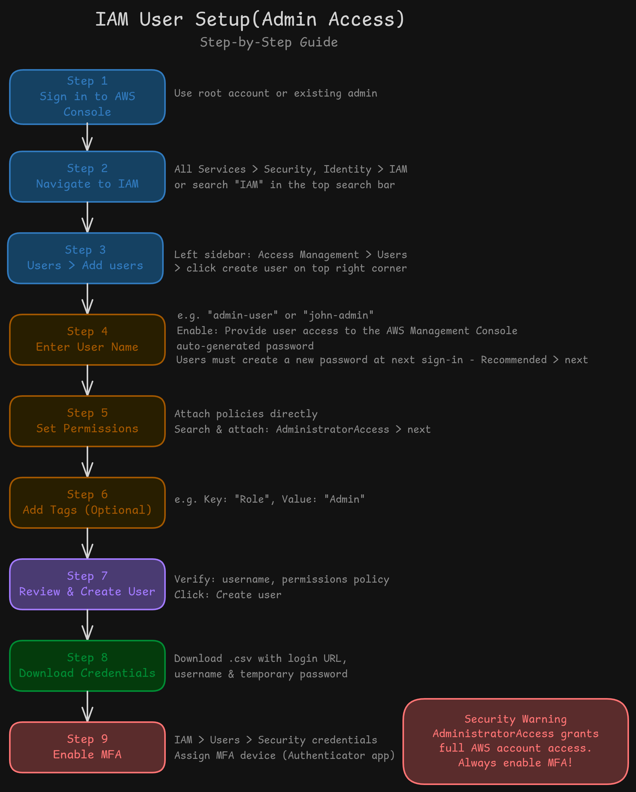

# IAM User Setup(Admin Access)

In this project I'll create IAM user for administrative purpose, avoiding the use of root account for day-to-day activities.

## Why this matters?

- Using root account for day-to-day activities is not recommended as per AWS best practices and root account has access to all aws services
- Secure access control
- Track user activity
- Enable MFA per user
- Revoke access without affecting the root account

## Objectives

- Create an IAM user with administrative access.
- Enable MFA for the IAM user.
- User should be able to access AWS services and perform operations.
- Minimize root account usage.

## Steps

1. Sign in to the AWS Console
   - Log in at console.aws.amazon.com using your root account or an existing admin.
2. Navigate to IAM
   - Go to Services > Security, Identity & Compliance > IAM
   - or simply search `IAM` in the top search bar.
3. In the left sidebar: Access Management > Users
   - Click Create user
4. Configure the User
   - Enter a username (e.g. admin-user or john-admin)
   - Provide user access to the AWS Management Console
   - Set a custom password or auto-generate one
   - Users must create a new password at next sign-in - Recommended
5. Attach Permissions
   - Select Attach policies directly
   - Search for and attach: `AdministratorAccess`
6. Add Tags (Optional but Recommended)
   - `Role`: `Admin`
   - Tags help with cost allocation and access auditing.
7. Review & Create
   - Confirm the username and attached policy, then click Create user.
8. Download Credentials
   - After creation, download the .csv file — it contains:
   - Console login URL
   - Username
   - Temporary password
   - > This is the only time you can download these credentials. Store them securely.
9. Enable MFA (Highly Recommended)
   - Go to IAM > Users > [your newly created user]
   - Security credentials > Under Multi-factor authentication (MFA), click Assign MFA device
   - Device name> Use an authenticator app (e.g. Google Authenticator, Authy)
   - Scan the QR code > Enter the 6-digit code from the app two times > Click Add MFA

## Test the IAM User

- Sign out of the root account
- Sign in using the new IAM user's credentials
  - Account ID: Your 12-digit AWS account ID (or alias)
  - Username: admin-yourname
  - Password: Your set password
- Enter MFA code when prompted
- Verify Permissions
  - Try accessing EC2, S3, IAM services

## Outcome

- Successfully created an Admin IAM user
- Successfully enabled MFA for the IAM user
- Verified the IAM user has administrative access
- Root account usage minimized

## Resources

- [IAM Best Practices](https://docs.aws.amazon.com/IAM/latest/UserGuide/best-practices.html)
- [AWS IAM Documentation](https://docs.aws.amazon.com/iam/)

# Author

K Subramanyeshwara-DevOps / Cloud Engineer
