# Users, Groups, and Managed Policies

In this project, we will learn about Users, Groups, and Managed Policies in AWS IAM. Creating different users and groups and attaching managed policies to them.

## Objective

- Create Users
- Create Groups
- Attach Users to Groups
- Attach Managed Policies to Groups
- Verify Permissions

## Prerequisites

- AWS Account
- AWS CLI installed and configured
- AWS IAM permissions to create users, groups, and policies

## Users

- Users represent a person or service that interacts with AWS.
- Created for a person or application.
- Users have a name, password, and access keys.
- Users can be assigned to groups.
- Users can be assigned to roles.
- Permissions are assigned through policies.

### Example Users

- `devops-user`: DevOps engineer managing infrastructure
- `dev-user`: Developer accessing EC2 and S3
- `admin-user`: Administrator managing AWS services

## Groups

- Group is a collection of users.
- Group is used to manage permissions for multiple users at once.
- Policies are attached to group, not individual users.
- Any user added to that group will inherit the permissions of the group.
- Groups can be assigned to roles.

### Example Groups

- `devops-group`: DevOps engineers managing infrastructure
- `dev-group`: Developers accessing EC2 and S3
- `admin-group`: Administrators managing AWS services

## Managed Policies

- Managed policies are policies that are created and managed by AWS.
- Managed policies contains rules that define what actions are allowed and denied.
- Managed policies can be attached to users, groups, and roles.
- Managed policies can be created by AWS or by you.
- Managed policies can be created by using the AWS Management Console, the AWS CLI, or the AWS SDKs.

## Simple Relationship

```
User > belongs to > Group
Group > has > Managed Policy
Managed Policy > defines > Permissions

User: Kunal
   ↓
Group: DevOps-Team
   ↓
Managed Policy: EC2FullAccess
```

## Creating Users

### Sign in to the AWS Console

- Log in at console.aws.amazon.com using your admin account.

### Navigate to IAM

- Go to Services > Security, Identity & Compliance > IAM
- or simply search `IAM` in the top search bar.

### In the left sidebar: Access Management > Users

- Click Create user

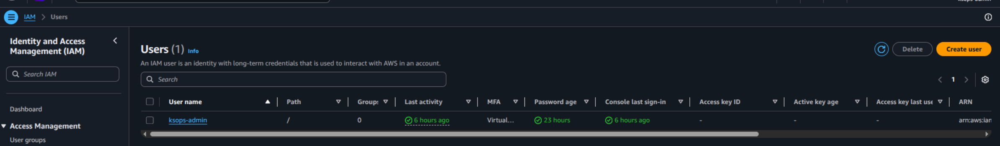

### Configure the User

- Enter a username (e.g. kunal-user)
- Provide user access to the AWS Management Console
- Set a custom password or auto-generate one
- Users must create a new password at next sign-in - Recommended

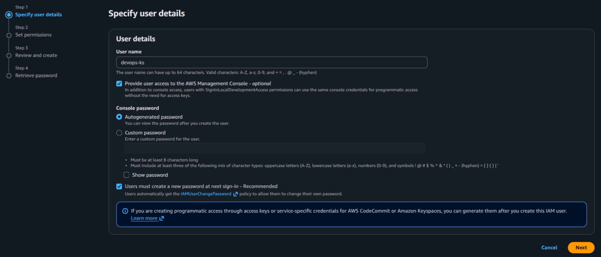

### Attach Permissions

- Select Add user to group
- Keep it empty for now as we don't have any groups created yet.

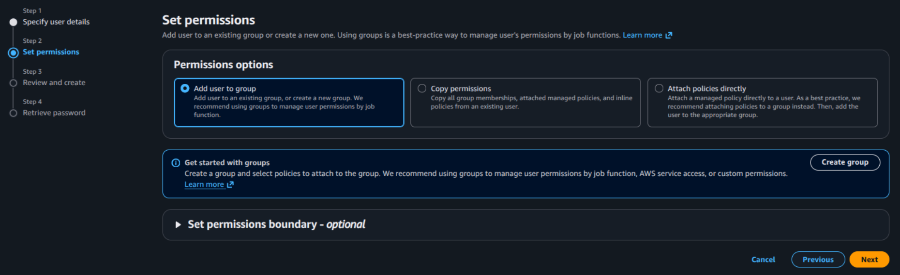

### Review & Create and add Tags (Optional but Recommended)

- `Role`: `devops`
- Tags help with cost allocation and access auditing.
- Confirm the username and attached policy, then click Create user.

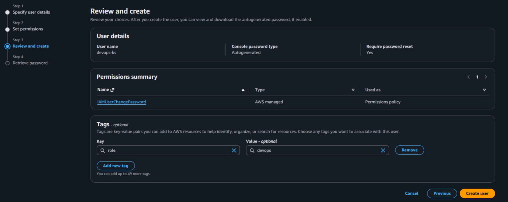

### Download Credentials

- After creation, download the .csv file — it contains:
- Console login URL
- Username
- Temporary password
- > This is the only time you can download these credentials. Store them securely.

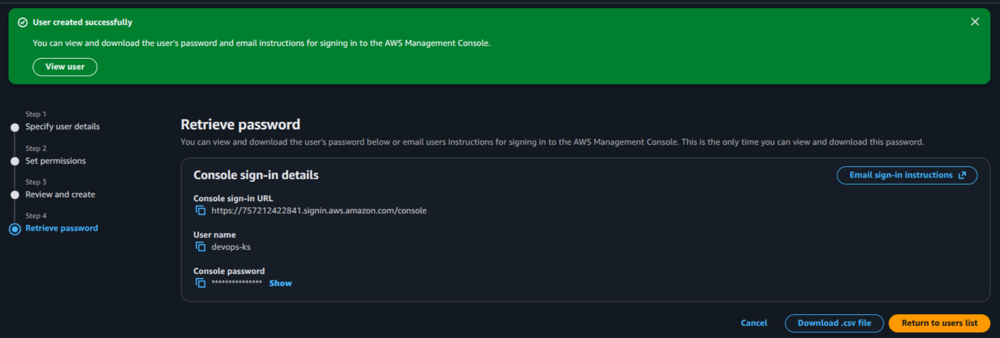

### Enable MFA (Highly Recommended)

- Go to IAM > Users > [your newly created user]
- Security credentials > Under Multi-factor authentication (MFA), click Assign MFA device
- Device name> Use an authenticator app (e.g. Google Authenticator, Authy)
- Scan the QR code > Enter the 6-digit code from the app two times > Click Add MFA

## Creating Groups

### Navigate to IAM > Access Management > Groups

- Click Create group

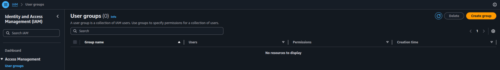

### Configure the Group

- Enter a group name (e.g. devops-group)
- Optionally, add users or attach policies directly
- Click Next

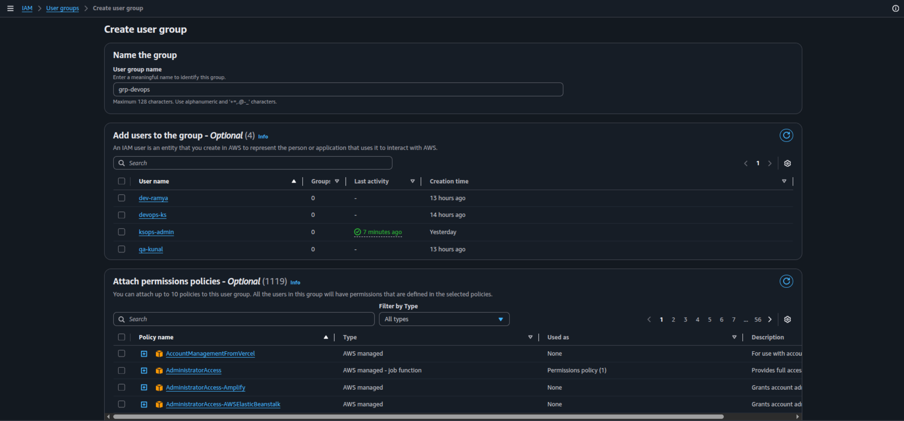

### Group Created

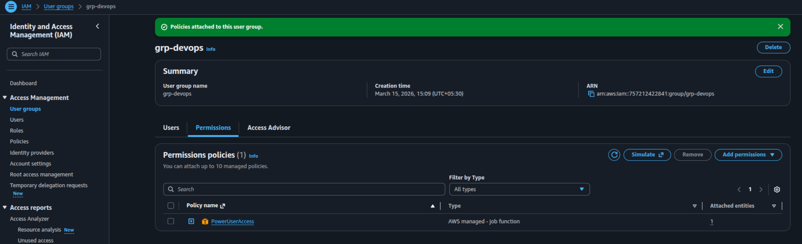

### Add Users to the Group

- Select the users you want to add to the group
- Click Add users

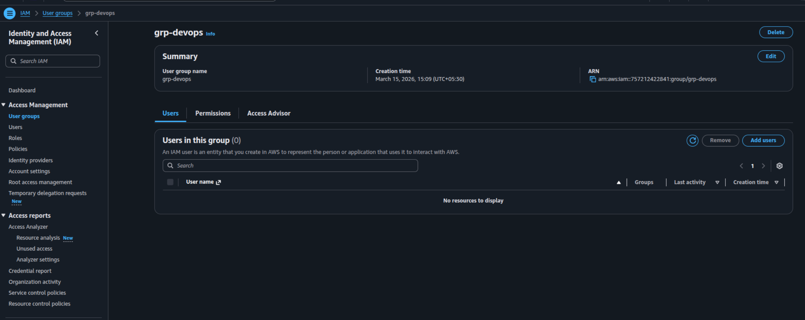

### Add Users to the Group

- Select the users you want to add to the group
- You can select single or multiple users at once
- Click Add users

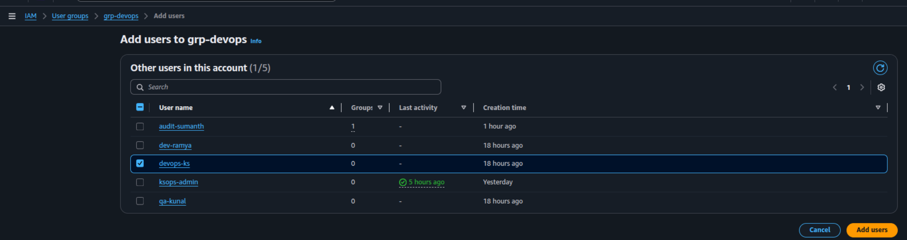

### Users Added to the Group

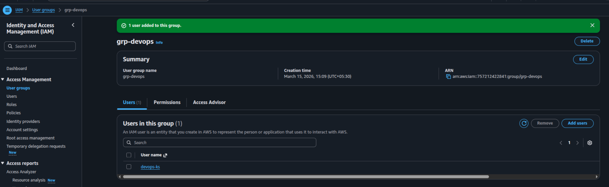

## Attaching Managed Policies

### Attach a Managed Policy to the Group

- Go to IAM > Access Management > Groups > [your group]
- Click Add permissions > Attach policies

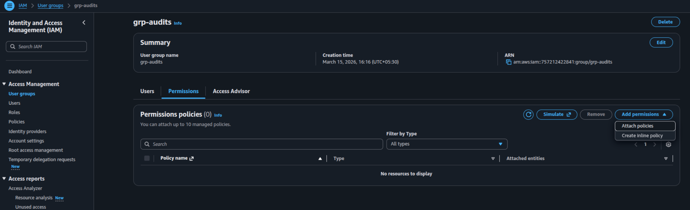

### Policy Attached

- Search for the policy you want to attach (e.g. AmazonS3FullAccess)
- Select the policy > Click Add permissions

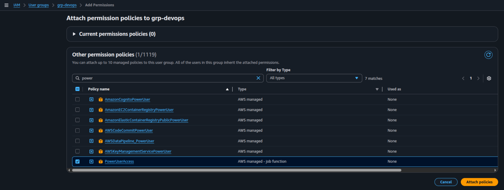

## Verifying User Permissions

- Log in as devops-user
- Try accessing the IAM service to verify the permissions
- Since the user have PowerUserAccess, permission to access IAM service is denied.
  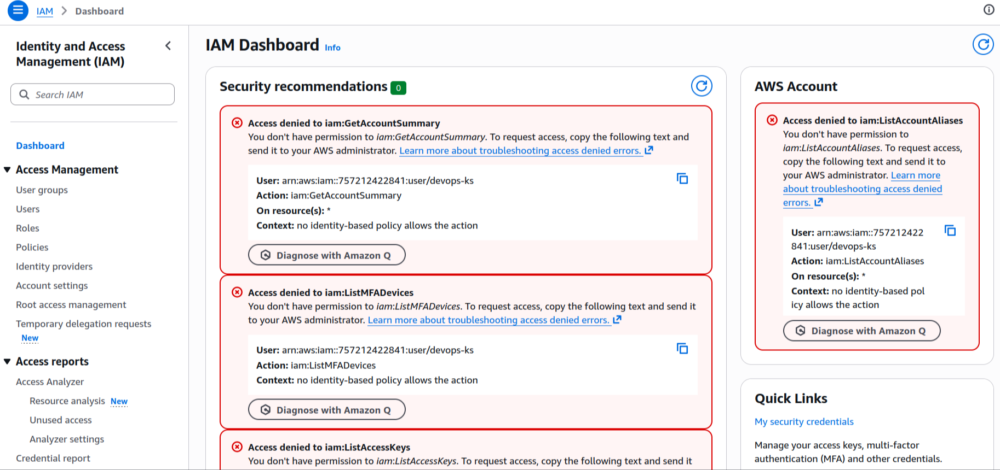
- Try creating EC2 instance, permission to create and access the instance is granted.
  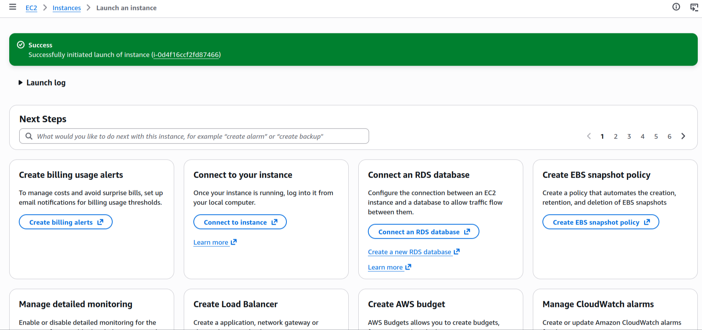

## Outcome

- Successfully created the various users and groups.
- Successfully added users to the appropriate group.
- Successfully attached the managed policy to the group.
- The user now has the permissions defined by the attached policy.

### Author

- [K Subramanyeshwara](https://github.com/ksubramanyeshwara) - Devops and Cloud Engineer.
