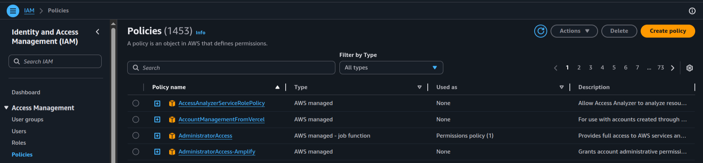
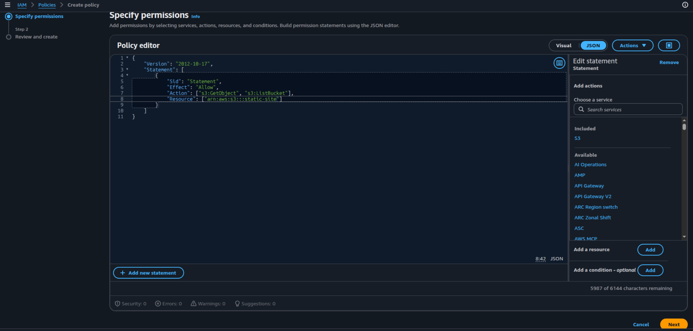
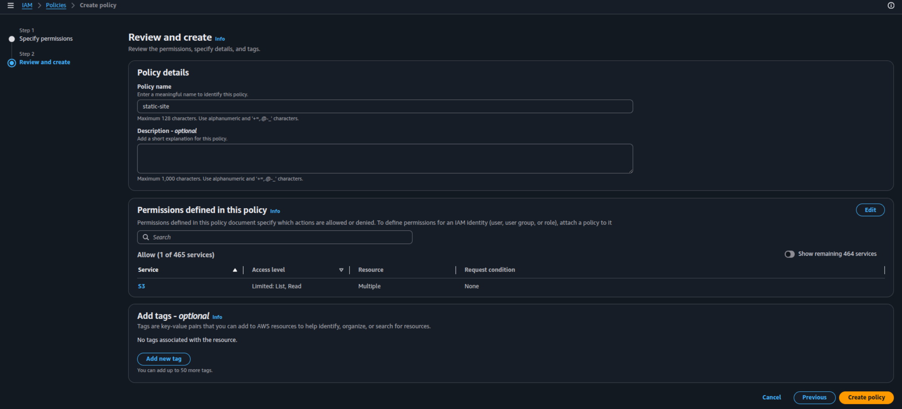
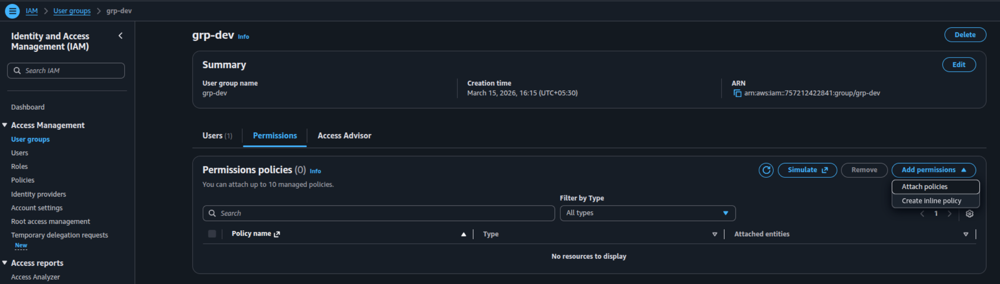
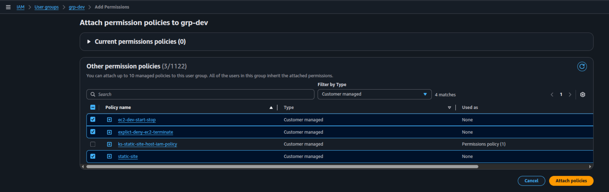
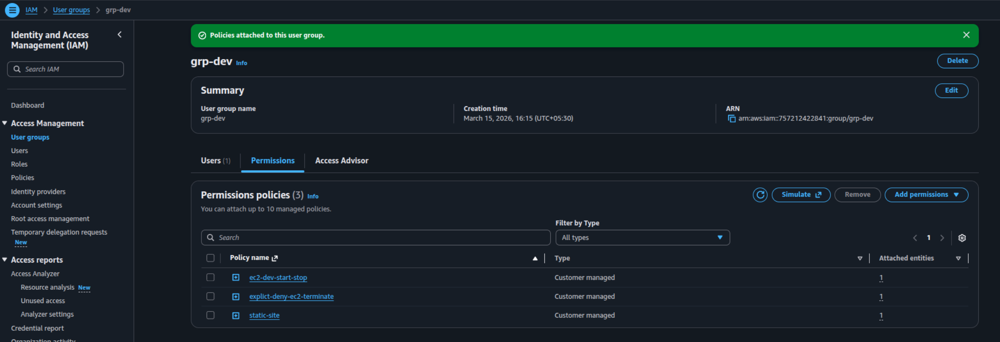

# Custom Policy with Least Privilege

In this project, I'll create leaste privilege custom policy.

## Objective

1. Create a custom policy with least privilege.
2. Attach the policy to a user or group.
3. Verify the policy is working as expected.

## Steps

### Navigate to IAM

- Go to Services > Security, Identity & Compliance > IAM
- or simply search `IAM` in the top search bar.

### Select Policies in the left sidebar

- Click Create policy



### Specify the Permissions

- Policy editor > select JSON tab
- Copy the following JSON and paste it in the editor

```json
{
  "Version": "2012-10-17",
  "Statement": [
    {
      "Sid": "ListBucket",
      "Effect": "Allow",
      "Action": "s3:ListBucket",
      "Resource": "arn:aws:s3:::static-site"
    },
    {
      "Sid": "GetObjects",
      "Effect": "Allow",
      "Action": "s3:GetObject",
      "Resource": "arn:aws:s3:::static-site/*"
    }
  ]
}
```

> One action + matching resource = one statement

- Click Next



### Review and Create the Policy

- Enter a name for the policy (e.g. `s3-read-only-policy`)
- Enter a description for the policy (e.g. `Allows read-only access to my-bucket`)
- Click Create policy



### Create two more policies

1.  Allow developer to start or stop the EC2 instance

    ```
    {
        "Effect": "Allow",
        "Action": [
            "ec2:StartInstances",
            "ec2:StopInstances",
            "ec2:DescribeInstances"
        ],
        "Resource": "\*",
        "Condition": {
            "StringEquals": {
                "ec2:ResourceTag/Environment": "dev"
            }
        }
    }
    ```

2.  Explicitly deny EC2 instance termination and User Deletion in IAM

    ```
    {
        "Effect": "Deny",
        "Action": [
            "ec2:TerminateInstances",
            "iam:DeleteUser"
        ],
        "Resource": "\*"
    }
    ```

### Attach all three policies to the developer group

- Go to IAM > Users groups > Select the group
- Click Add permissions > Attach existing policies directly



- Filter by type > Customer managed
- Select the policies you created > Attach policies





## Outcome

1. Successfully created a custom policy with least privilege.
2. Successfully attached the policy to a user or role.
3. Verified the policy is working as expected.

## Resources

- [AWS IAM Policy Simulator](https://policysim.aws.amazon.com)

### Author

- [K Subramanyeshwara](https://github.com/ksubramanyeshwara) - Devops and Cloud Engineer.
