# IAM Role Secure Access

In this project, I'll create AWS IAM Role that allows EC2 instances to securely access AWS S3 bucket without using access key and secret key.

## Prerequisites

- AWS Account

## Goal

1. Create an IAM Role
2. Create an EC2 instance
3. Attach the IAM Role to the EC2 instance
4. Create an S3 bucket
5. Upload a file to the S3 bucket
6. Access the file from the EC2 instance

## Architecture

```
EC2 Instance  →  IAM Role  →  S3 Bucket
        (No hardcoded credentials)
```

## Steps

### Create an S3 bucket

- Navigate to S3 service > General purpose buckets > Create bucket

  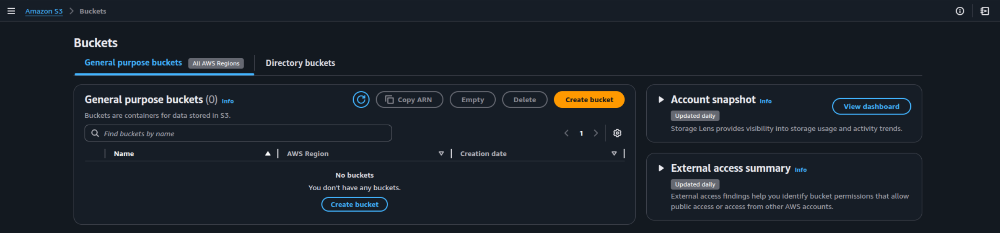

- Select bucket type as General purpose > Select AWS Region > Enter bucket name
- Select Object Ownership as ACLs disabled > Block all public access > Bucket versioning as enabled
- Default encryption Server-side encryption with Amazon S3 managed keys (SSE-S3) > Bucket Key as Enabled
- Click on Create bucket

  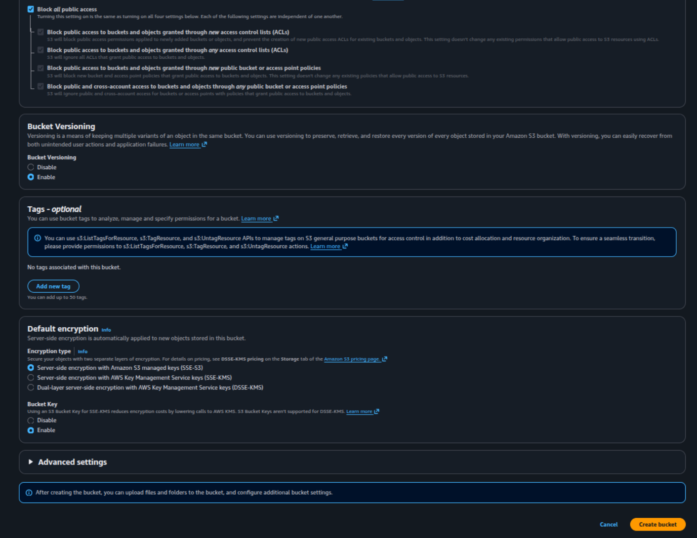

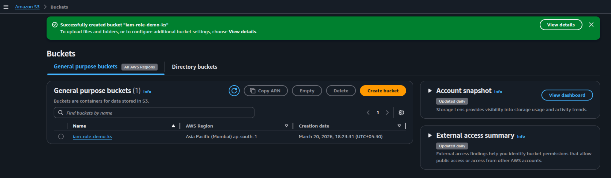

### Create IAM Role

- Navigate to IAM service > Access management > Roles > Create role

  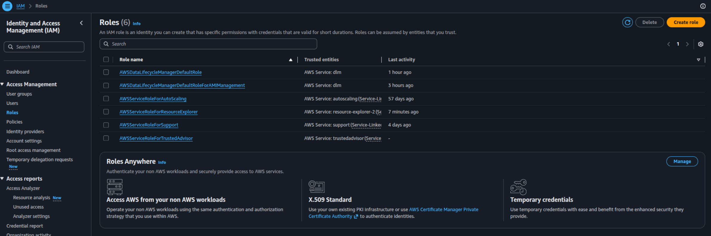

- Select Trusted entity type as AWS service > Use case as EC2 > Click on Next

  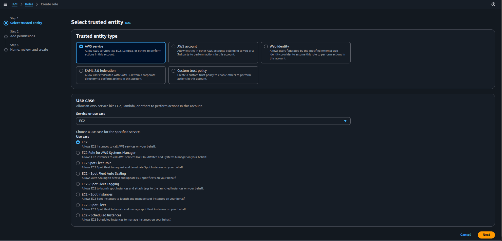

- Add permissions > Select AmazonS3ReadOnlyAccess > Click on Next

  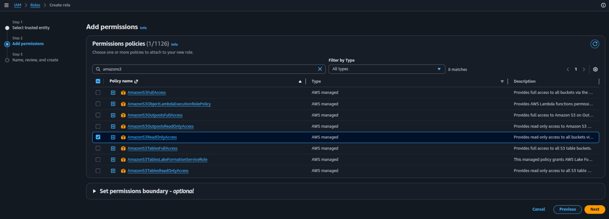

- Enter Role name as EC2-S3-Access-Role > Click on Create role

  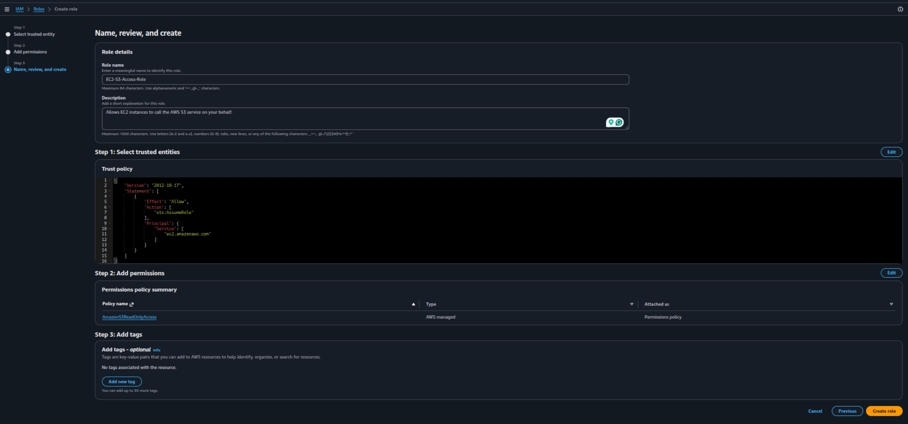

### Create EC2 instance

- Navigate to EC2 service > Instances > Launch instances
- Enter Name as EC2-S3-Access > Select Ubuntu 24.04 AMI > Select Instance type as t3.micro > Click on Create new key pair

  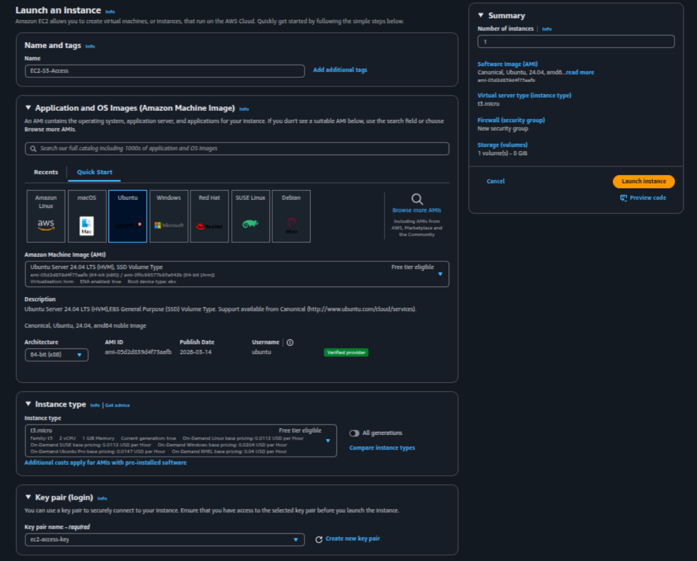

- Enter Key pair name as EC2-S3-Access > Click on Create key pair

  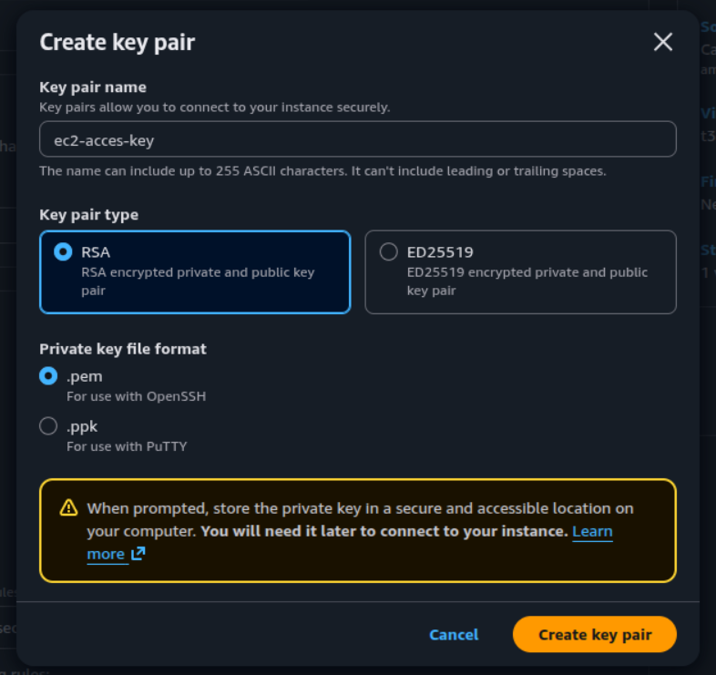

- Select network settings as default > Select default storage > Click on Launch instance
  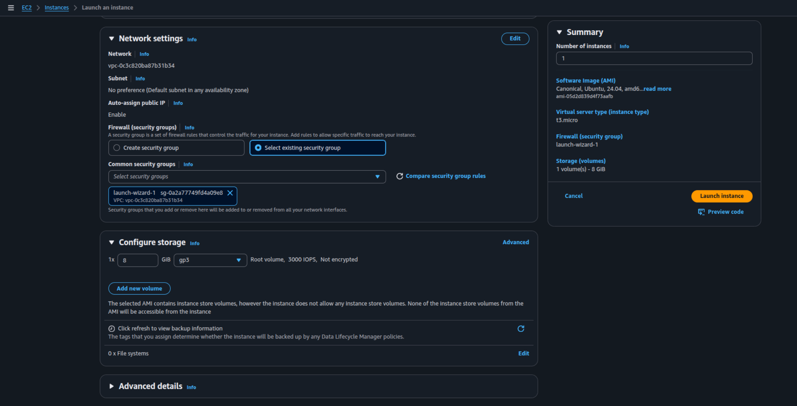

### Attach IAM Role to EC2 instance

- Select the EC2 instance > Click on Actions > Security > Modify IAM Role > Select EC2-S3-Access-Role > Click on Update IAM Role

  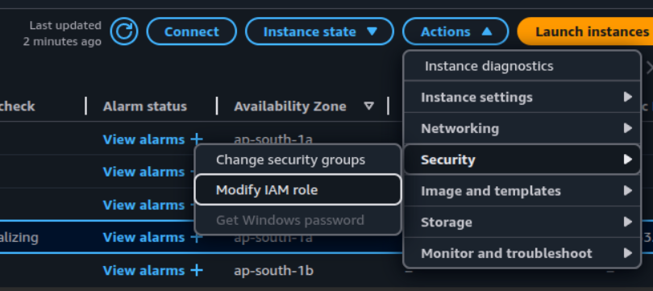

  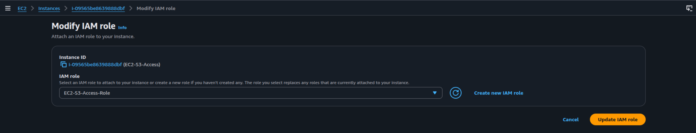

### Check access to S3 bucket from EC2 instance

- Connect to the EC2 instance using SSH
- Run the following command to list the S3 buckets

  ```bash
  aws s3 ls
  ```

  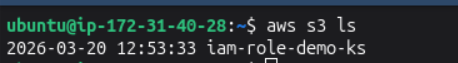

## Outcome

- Successfully created an S3 bucket.
- Successfully uploaded a file to the S3 bucket.
- Successfully created IAM Role, and an EC2 instance.
- Successfully attached the IAM Role to the EC2 instance.
- Successfully accessed the file from the EC2 instance.

## Key Learnings

- Difference between IAM User and IAM Role.
- Role based access.
- Least privilege principle.

## References

- [AWS IAM Roles](https://docs.aws.amazon.com/IAM/latest/UserGuide/id_roles.html)
- [AWS IAM Roles for EC2](https://docs.aws.amazon.com/IAM/latest/UserGuide/id_roles_use_switch-role-ec2.html)
- [AWS IAM Roles for S3](https://docs.aws.amazon.com/IAM/latest/UserGuide/id_roles_use_passrole.html)

### Author

- [K Subramanyeshwara](https://github.com/ksubramanyeshwara) - Devops and Cloud Engineer.
