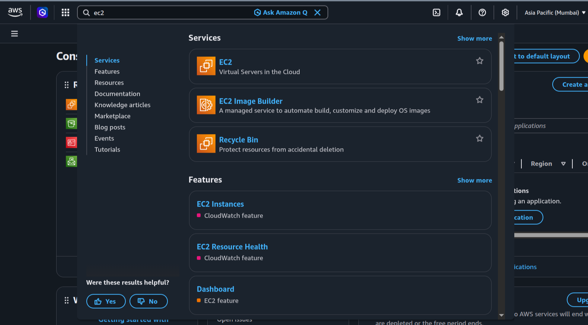
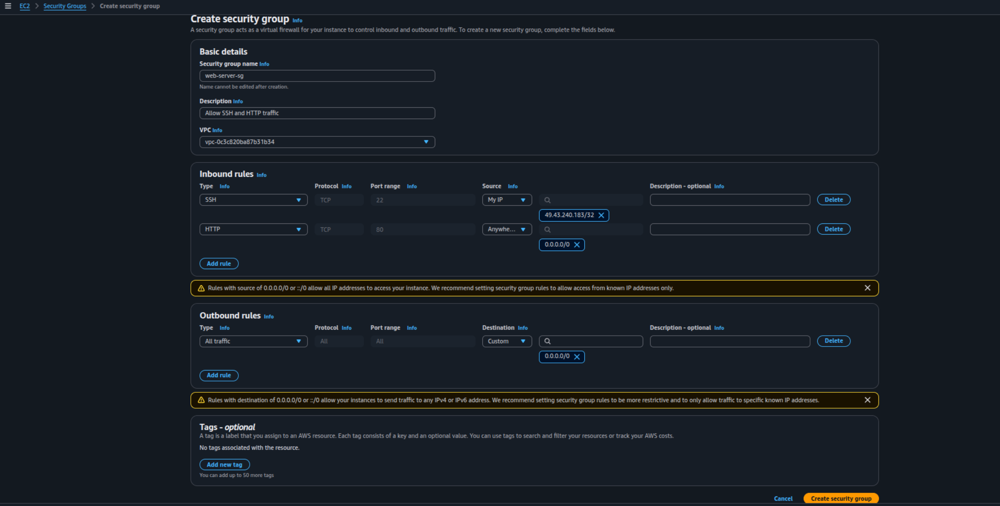
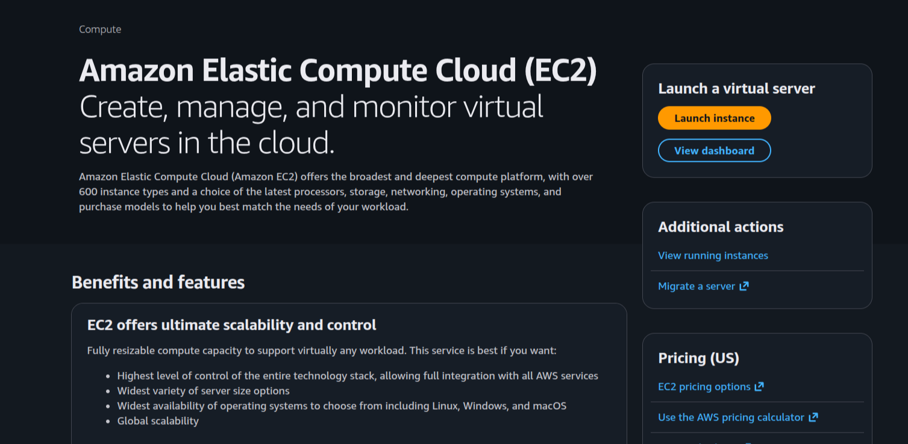
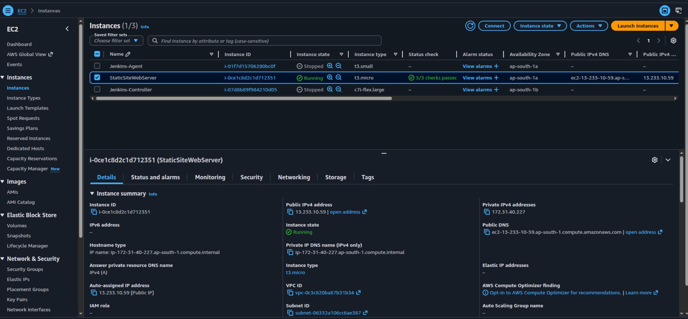
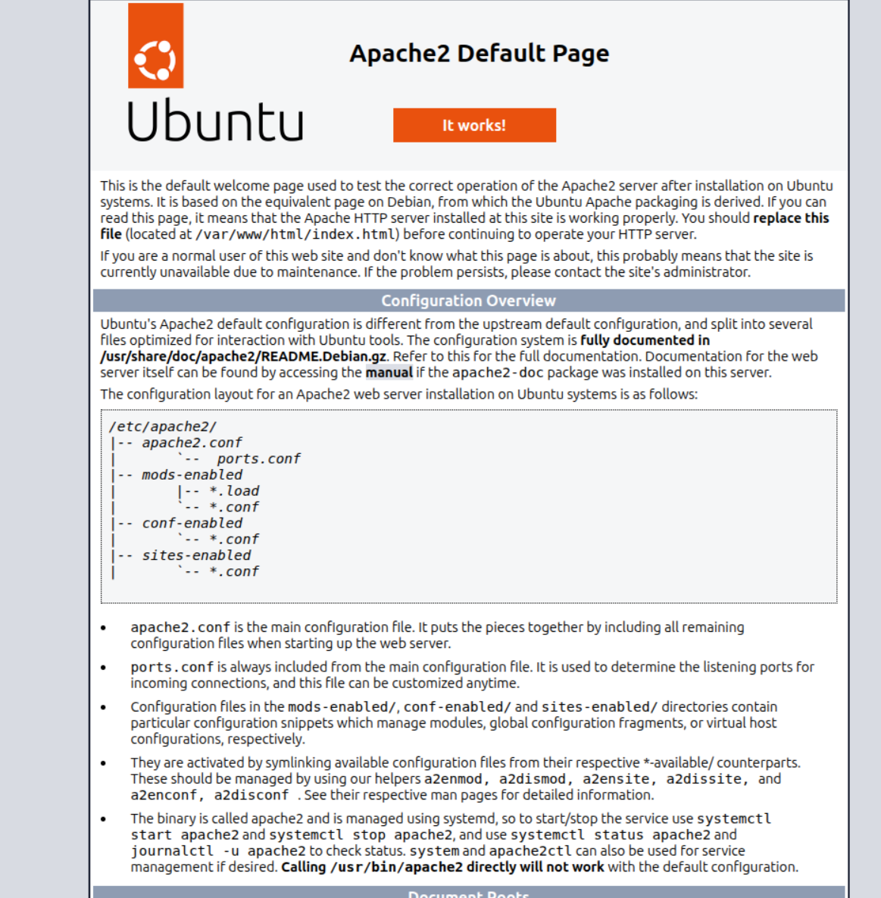
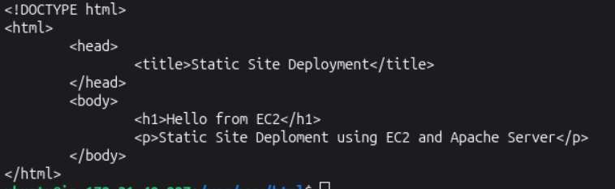
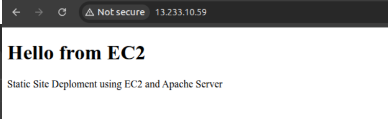

# EC2 Instance Launch

In this project, I will launch EC2 instance, configure security group, connect to the instance using SSH, install Apache web server, and deploy a static website.

## Objectives

- Configure security group.
- Launch an EC2 instance.
- Connect to the instance using SSH.
- Install Apache web server.
- Deploy a static website.

## Prerequisites

- AWS account

## Steps

### Login to AWS Management Console

- In the search bar, type EC2 and click on EC2.
  

### Create Security Group

- In Network & Security, select Security Groups.
- Click on Create security group.
- Enter the following details:
  - Security group name: `web-server-sg`
  - Description: `Allow HTTP and SSH traffic`
  - VPC: `default`
  - Inbound rules:
    - Type: `SSH`
    - Port: `22`
    - Source: `My IP`
    - Type: `HTTP`
    - Port: `80`
    - Source: `Anywhere`
  - Outbound rules:
    - Type: `All traffic`
    - Port: `All`
    - Source: `Anywhere`
- Click on Create security group.
  

### Launch EC2 Instance

- Click on Launch instance. Choose launch without walkthrough.
  
- Name your instance: `StaticSiteWebServer`
- Select `Ubuntu Server 24.04 LTS (HVM), SSD Volume Type`
- Instance Type: `Select t3.micro — 2 vCPUs, 1 GB RAM` Enough for a web server and eligible for the free tier
- Key pair: `Create new key pair`
  - Key pair name: `web-server-key`
  - Key pair type: `RSA`
  - Private key file format: `.pem`
  - Click Create key pair. The file will automatically download to your computer. Keep it safe!
- Network settings: Select existing security group
  - In Common security groups dropdown select `web-server-sg` security group
- Storage: Keep the default 8 GB gp3 EBS root volume
- Click on Launch instance.

### Connect to the Instance

- In the EC2 dashboard, wait for instance to be in running state.
- Click on the checkbox of the instance you created and Copy the `Public IPv4 address` from the instance details panel.
  
- Open your terminal and navigate to the directory where you saved the key pair file.
- Change the permissions of the key pair file to be read-only for the owner and no permissions for group and others.
- Connect to the instance using SSH.

### Install Apache Web Server

- Before you can install Apache, update your local package index. This is required to ensure you get the latest version of all packages.
- Install Apache server. `sudo apt install apache2 -y` for Debian/Ubuntu systems.
  
- Start the Apache server. `sudo systemctl start apache2`
- Check the status of the Apache server. `sudo systemctl status apache2`
- Open the Apache server in your browser. `http://<public-ip-address>`

### Deploy a static website

- change the directory into `/var/www/html`, because it is the default web root directory for Apache.
- Create a new file called `index.html` and add the following content to it.
  
- Refresh the browser and you should see the website content.
  

  > What is a Web Root?
  > It’s the folder where your website files are stored. Apache serves files from this location to users

## Outcome

- Successfully created a security group.
- Successfully launched an EC2 instance.
- Successfully connected to the instance.
- Successfully installed Apache web server.
- Successfully deployed a static website.

## Key Learnings

- Creating security group for allowing HTTP and SSH traffic.
- Launching an EC2 instance and connecting to it through SSH.
- Installing Apache web server and deploying a static website.

### Author

- [K Subramanyeshwara](https://github.com/ksubramanyeshwara) - Devops and Cloud Engineer.
