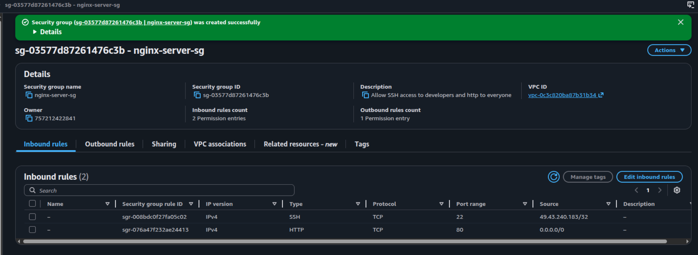
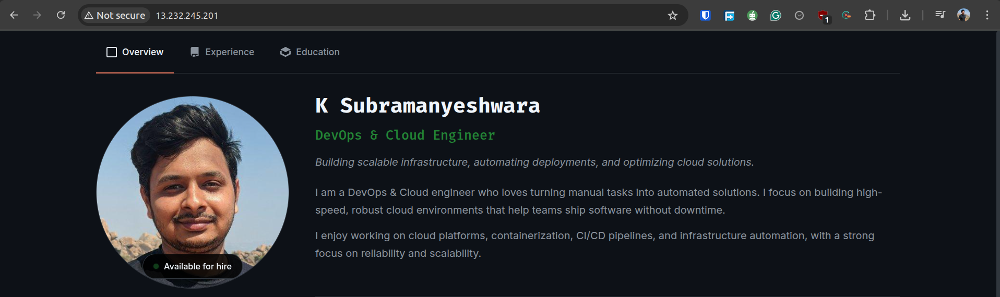

# Deploying a Static Website using Docker and NGINX on a Cloud VM

In this project, I will create an EC2 instance on AWS and deploy a static site using containerized Nginx server.

## Prerequisites

- A cloud VM (AWS EC2, Azure VM, GCP VM, etc.)
- Docker installed on your virtual machine
- Basic understanding of Docker and Nginx

## Objectives

- Create an EC2 instance on AWS.
- Install Docker on the EC2 instance.
- Deploy a static website using Docker and Nginx on a cloud VM.
- Ensure the website is accessible via the VM's public IP address.

## Project Structure

```
ks-portfolio/
    ├── images
    ├── Dockerfile
    ├── index.html
    ├── Jenkinsfile
    ├── README.md
    ├── script.js
    └── styles.css
```

## Architecture


## Steps to Run the Project

### Create a Security Group on AWS

- Create a security group named nginx-server-sg with following details:
- Allow HTTP (Port 80) from anywhere
- Allow SSH (Port 22) only from your IP address

  

### Create an EC2 instance on AWS

- Name EC2 instance as nginx-server
- Choose Ubuntu 24.04 LTS
- 1–2 vCPU | 2–4 GB RAM
- Key pair: create a new key pair named `nginx-server-key` and download it. Change the permission to `chmod 400 nginx-server-key.pem`
- In Common security groups dropdown select `nginx-server-sg` security group
- Storage: Keep the default 8 GB gp3 EBS root volume
- Click on Launch instance.

### Install Docker on the VM

- SSH into the VM using the key pair file `ssh -i nginx-server-key.pem ubuntu@<public-ip>`
- Update, upgrade packages and install Docker
  - sudo apt update && sudo apt upgrade -y
  - [Follow the documentation to install docker](https://docs.docker.com/engine/install/ubuntu/)
  - sudo systemctl start docker
  - sudo systemctl enable docker
- Verify Docker version & service status

### Clone the repository and Run the docker container

- Clone the repository `git clone https://github.com/ksubramanyeshwara/ks-portfolio.git`
- cd ks-portfolio
- Pull the Nginx image from Docker Hub: `docker pull nginx`
- Run the Nginx container with the static site files

```sh
docker run -d \
 --name ks-portfolio \
 -p 80:80 \
 -v /home/ubuntu/ks-portfolio:/usr/share/nginx/html \
 nginx
```

- > /usr/share/nginx/html: Nginx default directory to serve static files

### Verify the container is running

- Verify container status: `docker ps`
- Access the static site: `http://<public-ip>`



## Outcome

- The static website is successfully deployed using nginx container and accessible via the VM's public IP address.

## Key Learnings

- Creating security group for allowing HTTP and SSH traffic.
- Launching an EC2 instance and connecting to it through SSH.
- Installing Docker and deploying a static website using Docker and Nginx.

## Resources

- [Docker Documentation](https://docs.docker.com/)
- [Nginx Documentation](https://nginx.org/en/docs/)

### Author

- [K Subramanyeshwara](https://github.com/ksubramanyeshwara) - Devops and Cloud Engineer.
