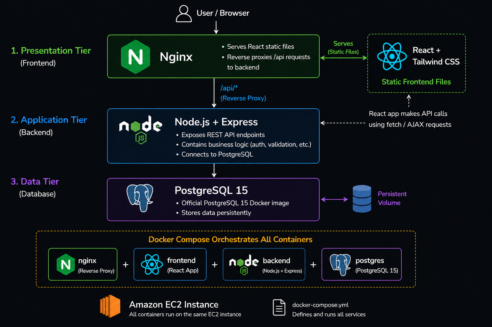
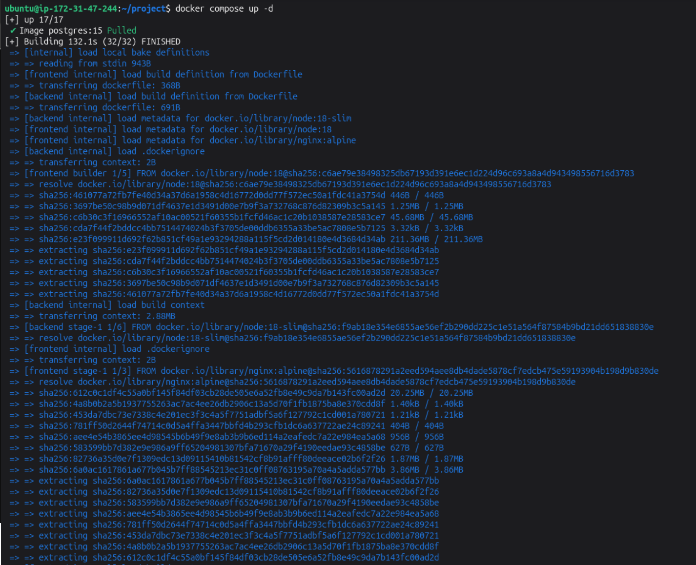
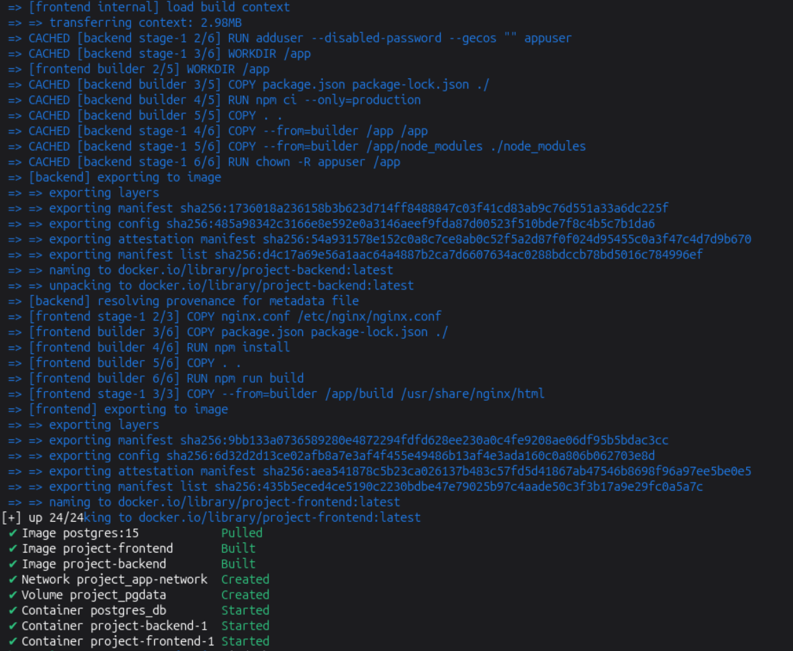
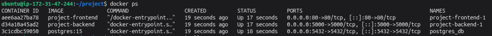
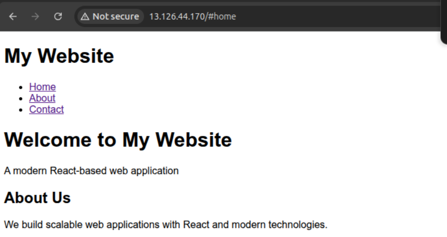
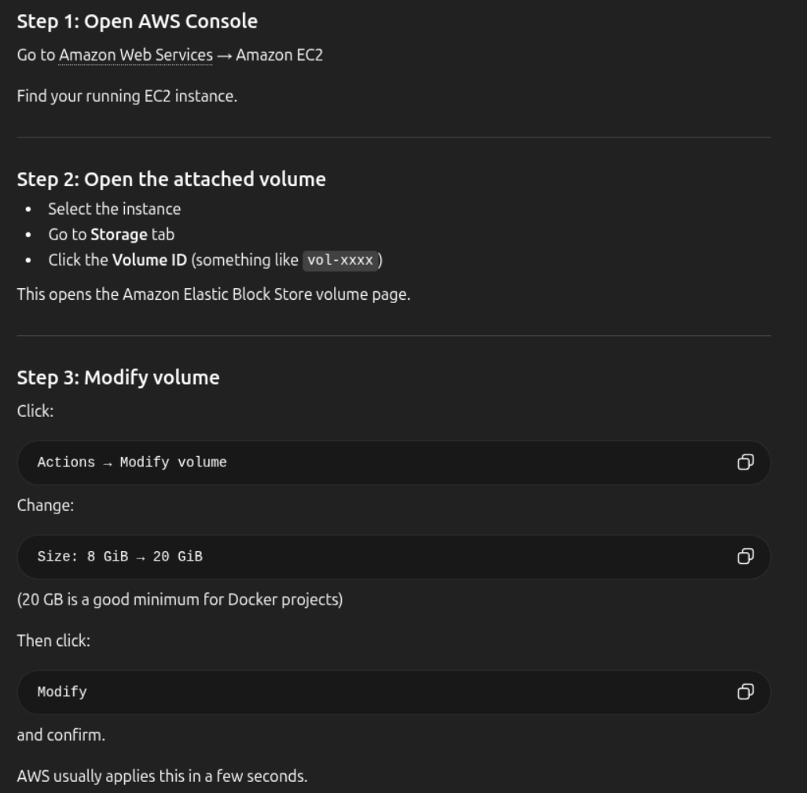

# 3-tier Applicaion Deploy on EC2 with Docker Compose

In this project, I am deploying a 3-tier container application with Docker Compose. Application will have:

1. Tier 1: Frontend: What users see in the browser.
2. Tier 2: Backend: Handles the requests and data processing.
3. Tier 3: Database: Stores the actual data.

## Prerequisites

- Docker installed on your machine.
- Basic understanding of Docker and Docker Compose.
- An AWS account.

## Objectives

- Deploying a multi-container application on EC2 using Docker Compose.
- Configuring network communication between Frontend, Backend, and Database tiers.
- Implementing data persistence for the database using Docker Volumes.

## Architecture



## Steps

### Create an EC2 Instance

- Create a security group.
  - Allow port 80 for anyone on the internet to access the website.
  - Allow port 22 for SSH, 5000 for Backend access and 5432 for Database access on your own IP. This will limit outsiders to access the Backend and Database.
- Create EC2 instance and attach the newly created security group and launch

### SSH into EC2 Instance

- Update and Upgrade the Instance.
- Install git if not installed
- Clone the repo into newly created folder called project `git clone -b react-tailwind-website https://github.com/bhavukm/3tier-react-tailwind.git`

### Dockerfile and Dockercompose file

- Write Dockerfile seperately for frontend and backend
- Use multistage build to keep the image size smaller
- Write docker-compose.yml file to run all 3 tiers together and link them together using docker network

### Run the containers

- docker compose up -d

  
  

- docker ps

  

- Open a browser and access the application: http://server-ip:80

  

## Issues and Fixes

### Docker build failing with `ENOSPC: no space left on device`

```
npm warn tar TAR_ENTRY_ERROR ENOSPC: no space left on device, write
```

This means EC2 machine has run out of disk space.

- Check disk usage with `df -h`
- Remove unused Docker data `docker system prune -a`
- Increase EC2 root volume
  
- Verify from server. `lsblk`
  - You may see the volume size increased, but the filesystem may still use old size.
- Expand the filesystem
  ```
  sudo growpart /dev/xvda 1
  sudo resize2fs /dev/xvda1
  ```
- If device is NVMe, then
  ```
  sudo growpart /dev/nvme0n1 1
  sudo resize2fs /dev/nvme0n1p1
  ```

## Outcomes

- Successfully deployed a 3-tier application on EC2 using Docker Compose.

## Author

- [K Subramanyeshwara](https://github.com/ksubramanyeshwara) - Devops and Cloud Engineer.
