# Highly Available Multi-Tier AWS VPC Architecture with Auto Scaling and Load Balancing

In this project, I will create highly available VPC across multiple Availability Zones. Intigrated public and private subnets, internet gateway for internet connectivity and NAT gateway for controlled outbound access. EC2 instances are deployed accross subnets and used load balancer for for traffic distribution.

## Objectives

- Create a custom VPC with public and private subnets across two Availability Zones.
- Configure an Internet Gateway for public access and a NAT Gateway for private subnet internet connectivity.
- Deploy an Application Load Balancer (ALB) to distribute incoming traffic to web servers.
- Implement an Auto Scaling Group (ASG) to ensure high availability and fault tolerance.
- Set up Security Groups to enforce the principle of least privilege for network traffic.
- Verify the architecture by testing load balancing and automatic instance recovery.

## Prerequisites

- AWS account with appropriate permissions.
- Basic understanding of VPC, Subnets, and Routing.
- Familiarity with EC2, Application Load Balancers, and Auto Scaling Groups.

## Architecture

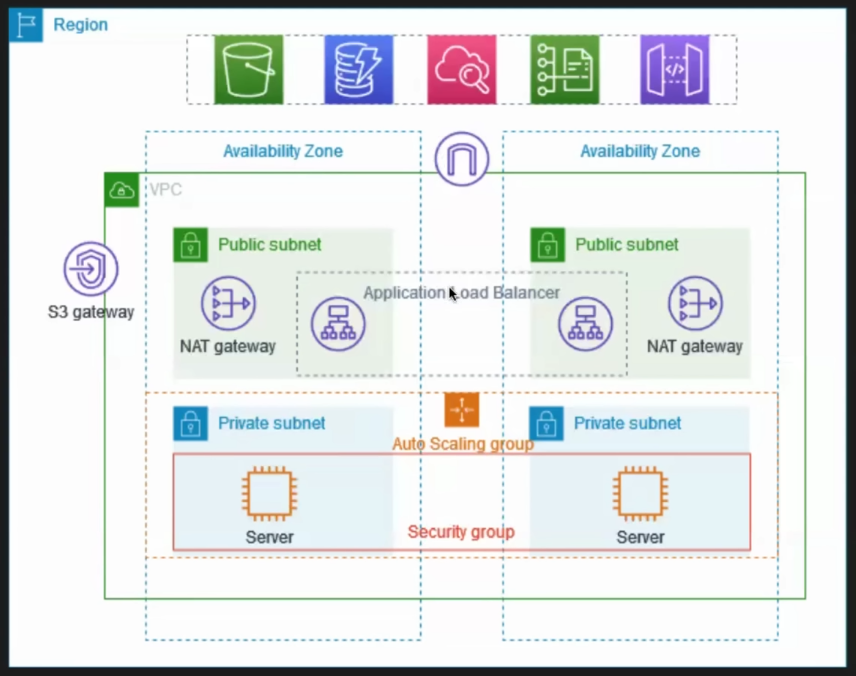

## Steps

### Create a VPC

- Go to the VPC Dashboard in the AWS Management Console and click on "Create VPC".
- Select VPC abd more options, provide a name for the VPC, and specify an IPv4 CIDR block.
- Select the availability zones for the VPC. In our case we will select two availability zones to ensure high availability.
- Select the number of public and private subnets you want to create in each availability zone. In our case we will create two public and two private subnets, one in each availability zone.
- Select the zonal NAT gateway option and select 1 per availability zone. This will ensure that each availability zone has its own NAT gateway for better performance and fault tolerance.
- VPC endpoints are optional, so select none for this project.
- Review the configuration and click on "Create VPC" to create the VPC.

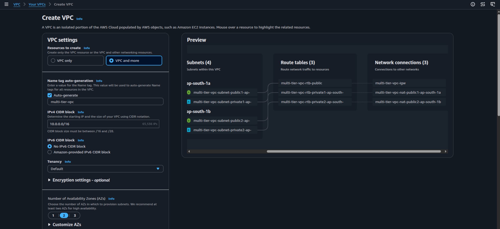
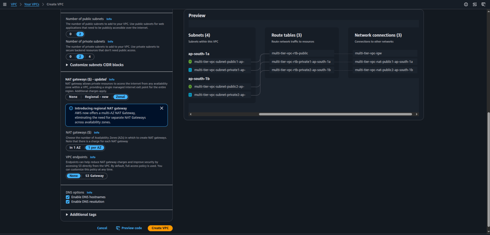

### Create a Launch Template.

- Go to the EC2 Dashboard, select the "Auto Scaling Groups" under the "Auto Scaling" section. Click on "Create Auto Scaling Group".
- You cannot create an Auto Scaling Group without a launch template. So, create a launch template first by providing a name, selecting an AMI, instance type, Key pair, and security group.
- In security group, select the newly created VPC.
- Edit inbound rules to allow SSH (port 22) and Custom TCP (port 8000) traffic from anywhere.

  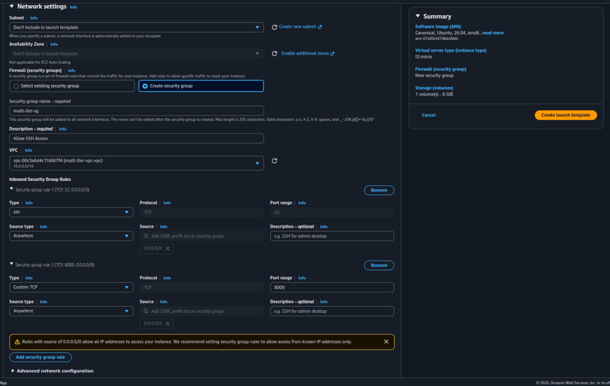

- Click on "Create launch template" to create the launch template.

### Create an Auto Scaling Group

- Name your Auto Scaling Group and select the launch template you just created.
- Choose the VPC and select the private subnets you created earlier.
- Do not attach any load balancer at this stage, we will do it later.
- Select the desired capacity, minimum capacity, and maximum capacity for your Auto Scaling Group. For example, you can set the desired capacity to 2, minimum capacity to 1, and maximum capacity to 4.
- Click on "Create Auto Scaling Group" to create the Auto Scaling Group.
- Once the Auto Scaling Group is created, go to the instances tab and verify that the instances are launched in the private subnets.

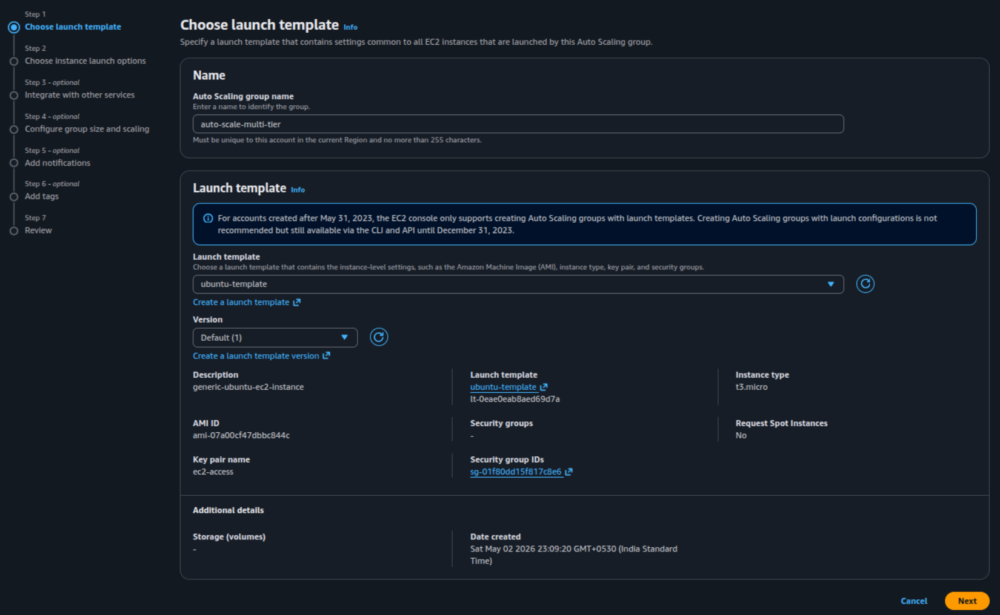
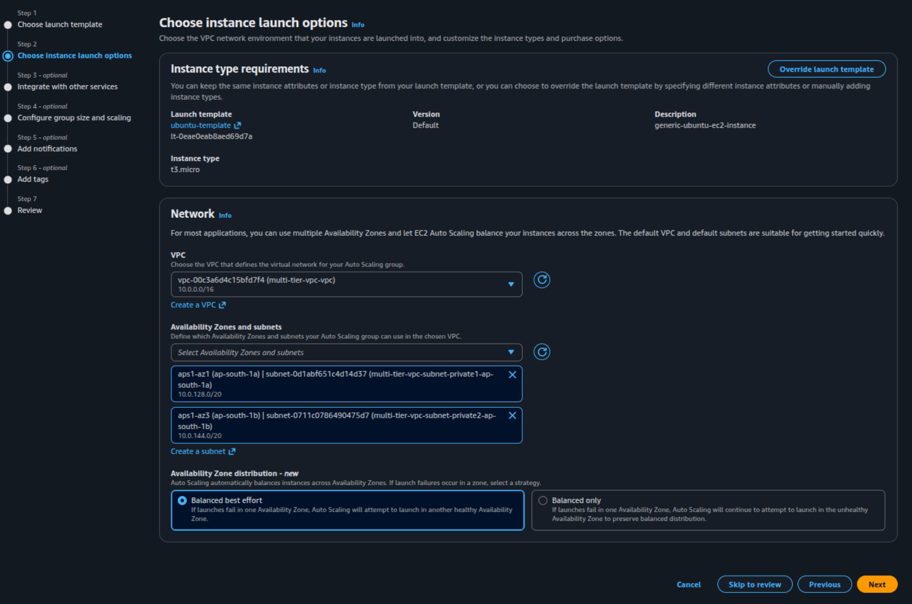

### Create a Bastion Host

- Go to the EC2 Dashboard, select the "Instances" under the "EC2" section. Click on "Launch Instance".
- Select an AMI, instance type, and Key pair for the bastion host.
- Select the VPC and select the public subnet you created earlier.
- Enable Auto-assign Public IP to ensure that the bastion host has a public IP address for SSH access.
- Click on Launch Instance to create the bastion host.

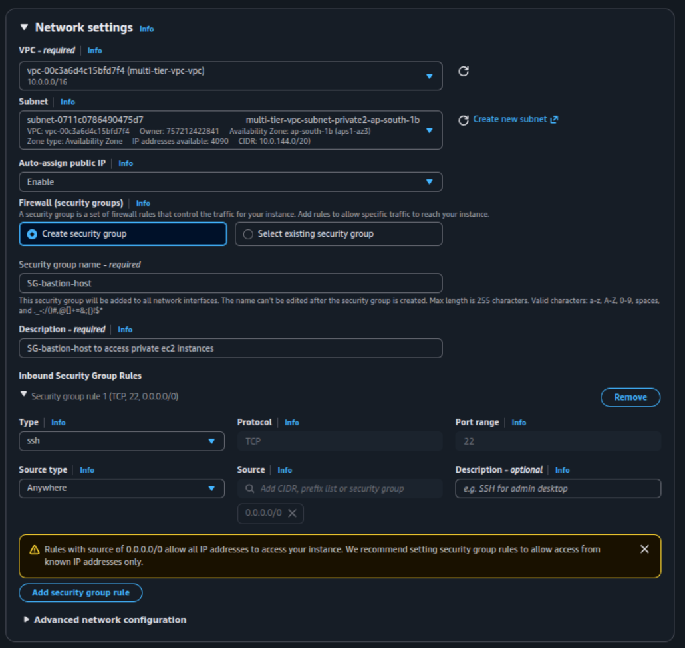

### Create a Target Group

- Go to the EC2 Dashboard, select the "Target Groups" under the "Load Balancing" section. Click on "Create Target Group".

  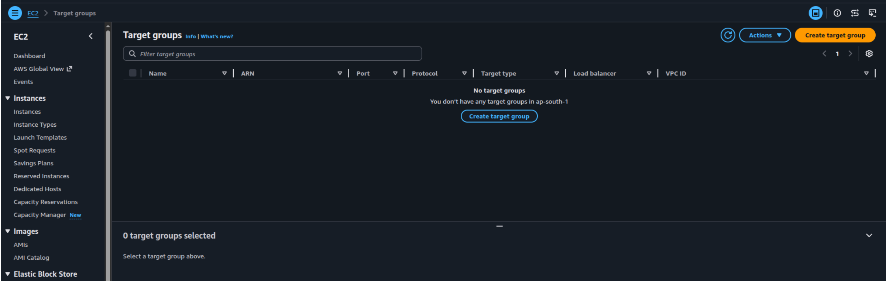

- Select the target type as "instance"
- Provide a name for the target group.
- Select HTTP as the protocol and port 80 and IPv4 as the IP address type.
- Select the VPC you created earlier.
- Select the health check protocol as HTTP and the path as / and click next.
  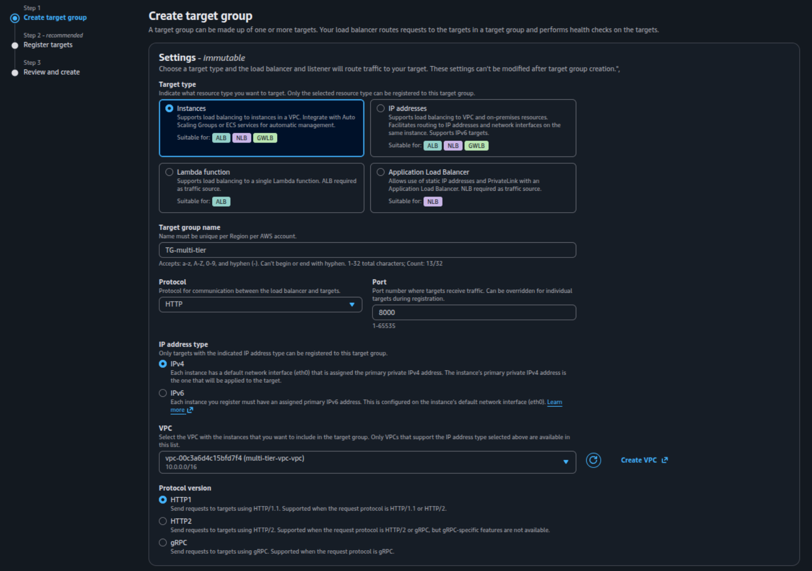
  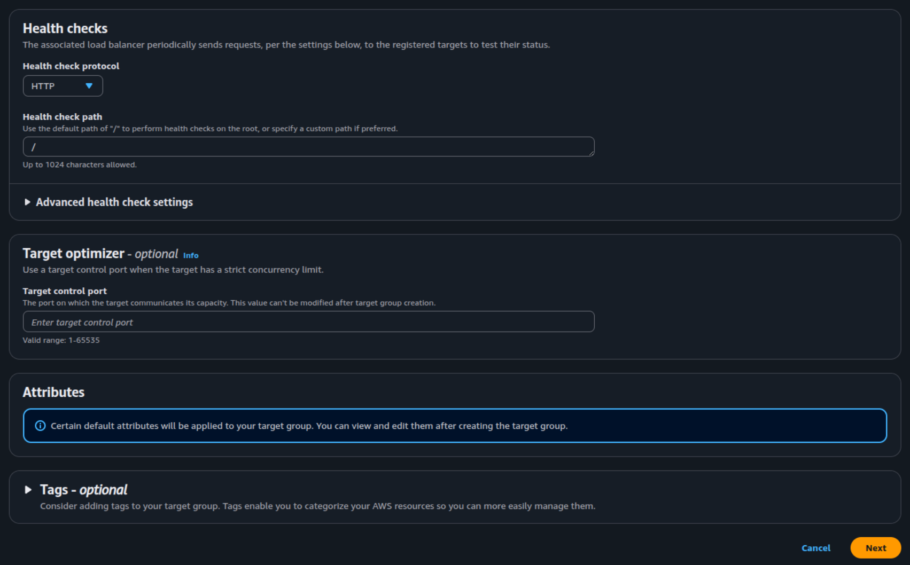
- Select the instances that are part of the Auto Scaling Group and Include as pending below and click next.
  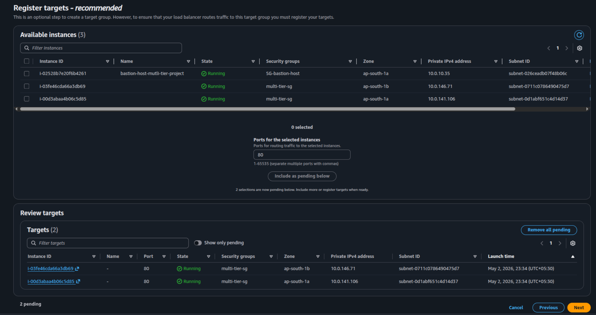
- Review the configuration and click on "Create Target Group" to create the target group.
  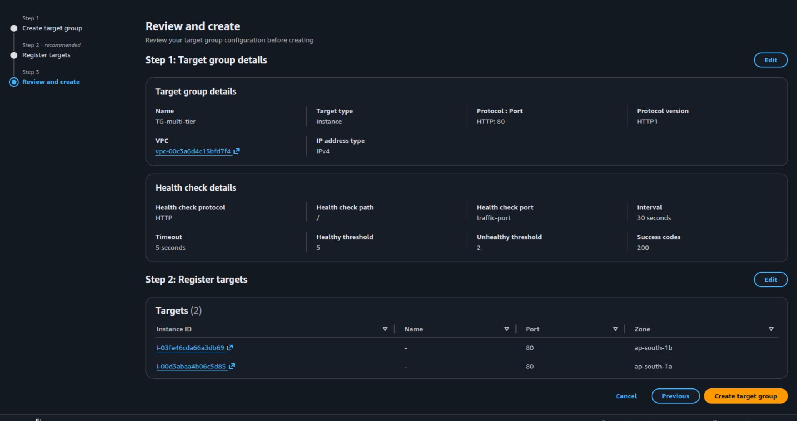

### Create an Application Load Balancer

- Go to the EC2 Dashboard, select the "Load Balancers" under the "Load Balancing" section. Click on "Create Load Balancer".
- Select "Application Load Balancer" and click on "Create".

  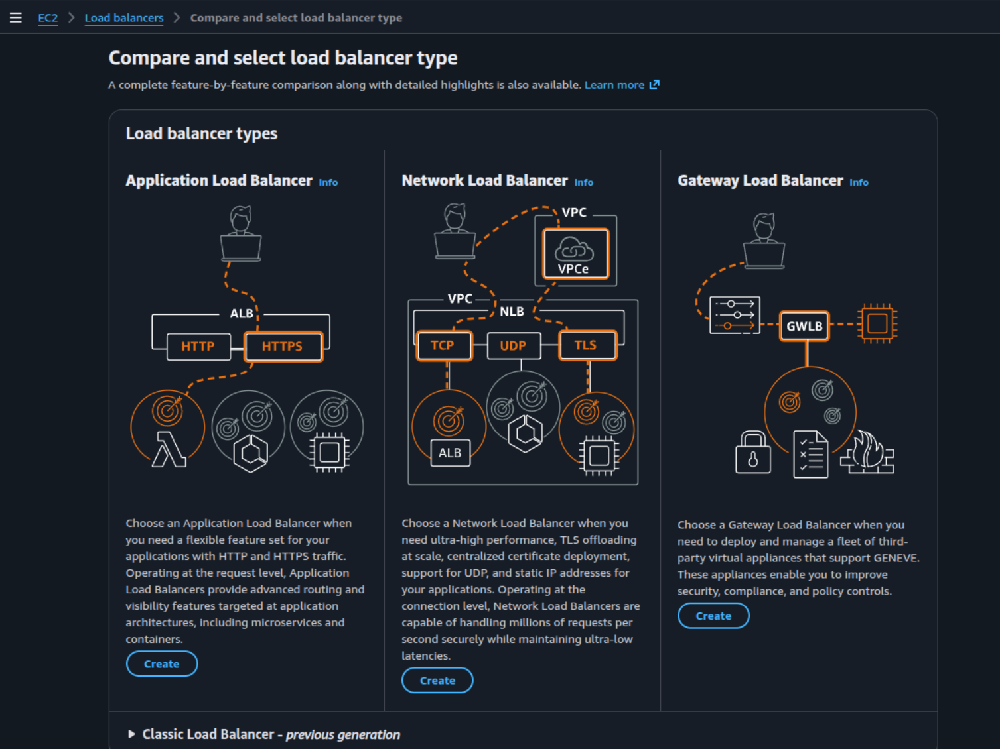

- Provide Load balancer name, select the scheme as "internet-facing", Load balancer IP address type as "ipv4" and in Network mapping, select the VPC you created earlier.
- Select the both availability zones and the public subnets you created earlier.
- Select the security group for the load balancer. The security group should allow inbound traffic on port 8000, and HTTP (port 80) from anywhere.

  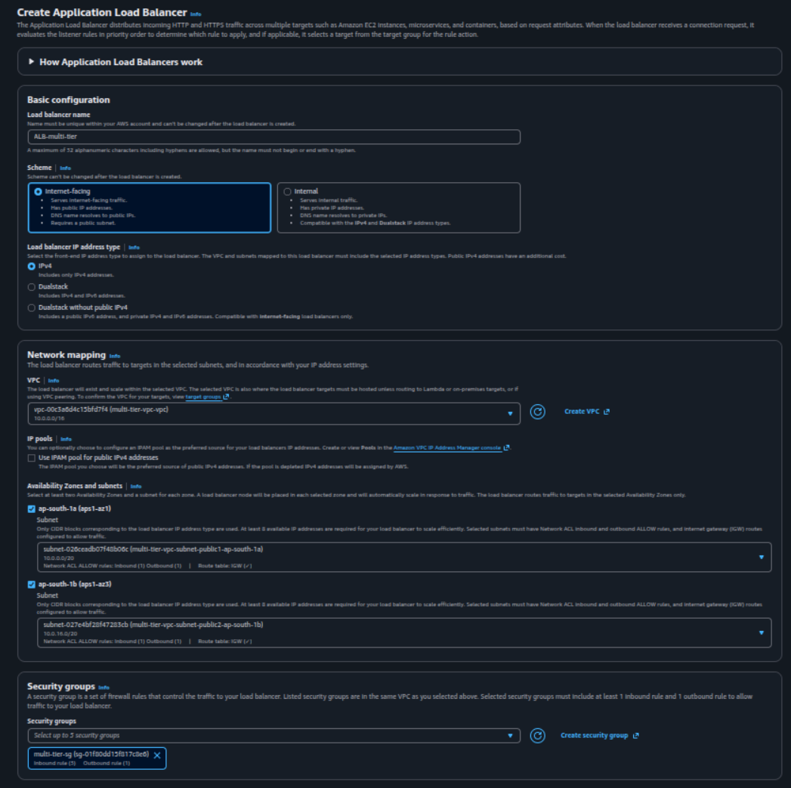

- In the "Listeners and Routing" step, select the target group you created earlier and click on Create Load Balancer.

  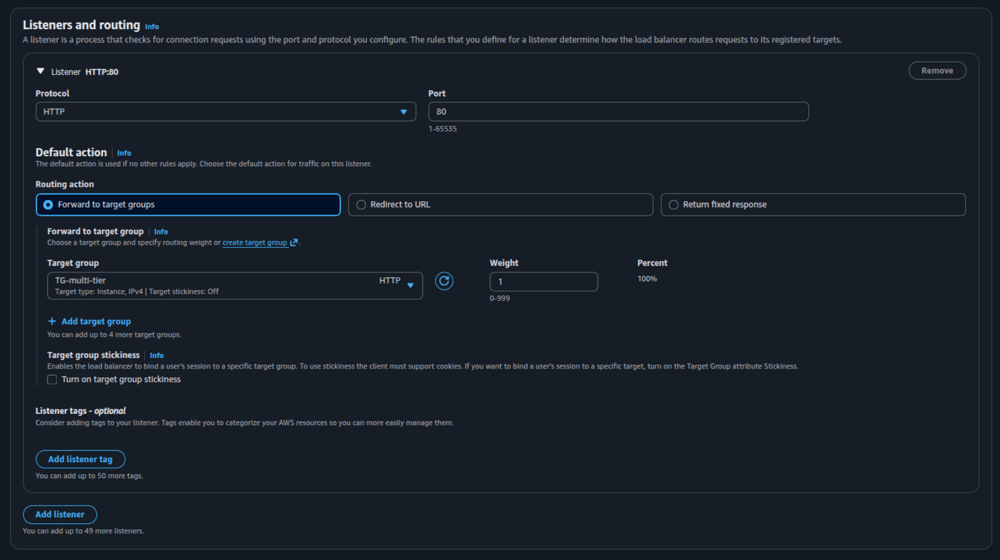

### Login to the Bastion Host

- Go to the EC2 Dashboard, select the "Instances" and select the bastion host instance you created earlier.
- Copy the public IP address of the bastion host.
- Open a terminal and use the following command to copy the private key file from local machine to the bastion host:

  ```bash
  scp -i /path/to/your/private-key.pem /path/to/your/private-key.pem ec2-user@<bastion-host-public-ip>:/home/ec2-user/
  ```

- SSH into the bastion host using the following command:

  ```bash
  ssh -i /path/to/your/private-key.pem ec2-user@<bastion-host-public-ip>
  ```

- Once you are logged into the bastion host, you can use the following command to SSH into the instances in the private subnets:

  ```bash
  ssh -i /home/ec2-user/private-key.pem ec2-user@<private-instance-ip>
  ```

### Configure the Web Server

- After logging into the private instance, create a simple HTML file and run a simple python HTTP server using the following command:

  ```bash
  python3 -m http.server 8000
  ```

- This will start a simple HTTP server on port 8000. You can access this server using the public IP address of the load balancer on port 80.

## Issues and Fixes

> The maximum number of addresses has been reached in Allocate elastic IP.

- This error occures when your aws account has reached the limit of elastic IP's that can be allocated. To fix this issue, you can either release any unused elastic IPs or request a limit increase from AWS.

## Outcomes

- Successfully created a highly available VPC architecture with public and private subnets across multiple Availability Zones.
- Configured an Internet Gateway for public access and a NAT Gateway for private subnet internet connectivity.
- Deployed an Application Load Balancer to distribute incoming traffic to web servers.
- Implemented an Auto Scaling Group to ensure high availability and fault tolerance.
- Set up Security Groups to enforce the principle of least privilege for network traffic.
- Verified the architecture by testing load balancing.

## Author

- [K Subramanyeshwara](https://github.com/ksubramanyeshwara) - Devops and Cloud Engineer.
