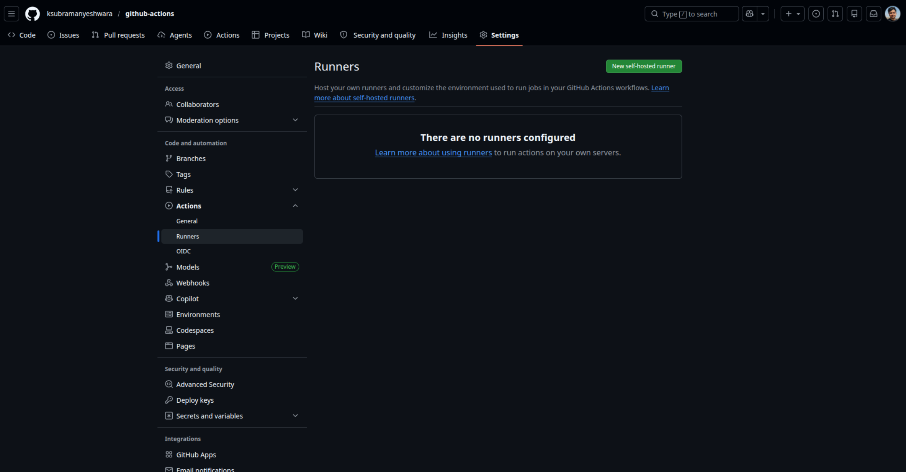
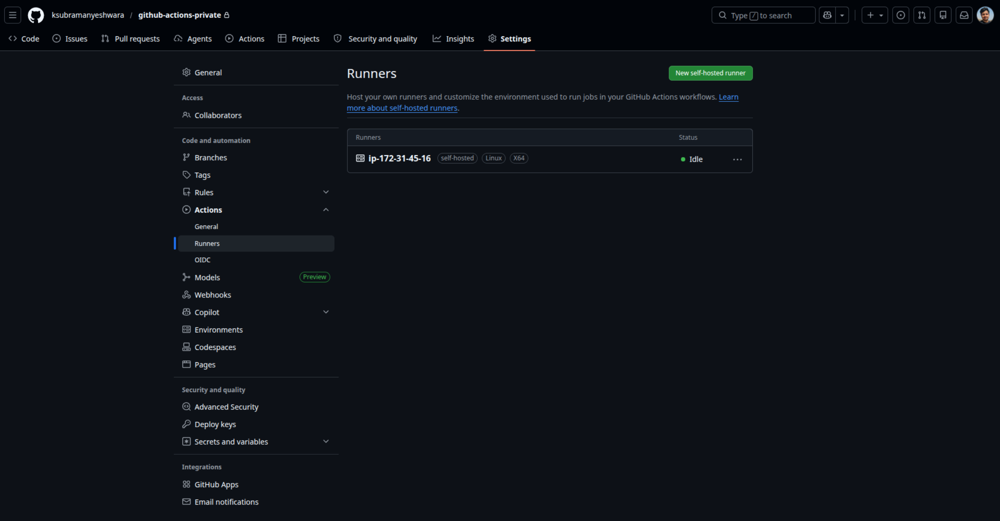

# GitHub Actions Self-hosted Runner on AWS EC2

In this project, I will set up a self-hosted runner for GitHub Actions on an AWS EC2 instance. This allows you to run your GitHub Actions workflows on your own infrastructure, giving you more control over the environment and resources used for your CI/CD pipelines.

## Objectives

- Set up a self-hosted runner for GitHub Actions on an AWS EC2 instance.
- Configure the runner to execute GitHub Actions workflows.
- Monitor the runner's performance and logs.

## Prerequisites

- AWS account
- GitHub account
- Basic understanding of GitHub Actions and AWS EC2

## Steps

### Launch an EC2 instance

- Go to AWS EC2 and create a security group that allows HTTP and HTTPS traffic for both inbound and outbound connections and SSH traffic for inbound connections.
- Go to AWS EC2 and launch an instance with Ubuntu 26.04 LTS and select the security group you created earlier.

### Create a new self-hosted runner

- Go to your GitHub Account and create a new private repository, click on "Settings" > "Actions" > "Runners" > "New Self-hosted Runner".
  

### Set up the self-hosted runner on your EC2 instance

- Follow the instructions and run the commands on your EC2 instance to set up the self-hosted runner.
- After the setup is complete, you should see the runner listed in your repository's settings under "Actions" > "Runners".
  
- You can now use this self-hosted runner in your GitHub Actions workflows by specifying `runs-on: self-hosted` in your workflow YAML file.

- For example:

```yaml
name: CI
on:
  push:
    branches: [main]
jobs:
  build:
    runs-on: self-hosted
    steps:
      - name: Print Hello World
        run: echo "Hello, World!"
```

- You can use the `sudo journalctl -u actions.runner.* -f` command on your EC2 instance to view the logs of the self-hosted runner and monitor the execution of your workflows.

## Important Notes

> GitHub recommends using self-hosted runners carefully with public repositories, because pull requests from forks can run untrusted code on your machine.

> As of March 1, 2026, GitHub introduced a change to the cost model for self-hosted runners in private repositories:
> Platform Fee: A charge of $0.002 per minute applies to jobs run on self-hosted runners in private repos. This covers the orchestration and control plane.

## Outcomes

- Successfully set up a self-hosted runner for GitHub Actions on an AWS EC2 instance.
- Configured the runner to execute GitHub Actions workflows.
- Monitored the runner's performance and logs.

## Author

- [K Subramanyeshwara](https://github.com/ksubramanyeshwara) - Devops and Cloud Engineer.
